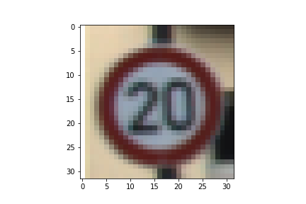

# **Traffic Sign Recognition** 

## Writeup

## Rubric Points
### Here I will consider the [rubric points](https://review.udacity.com/#!/rubrics/481/view) individually and describe how I addressed each point in my implementation.  

---
### Writeup / README

#### 1. Provide a Writeup / README that includes all the rubric points and how you addressed each one. You can submit your writeup as markdown or pdf. You can use this template as a guide for writing the report. The submission includes the project code.

You're reading it! and here is a link to my [project code](https://github.com/jasdeep06/Udacity-Traffic-Sign-Classifier)

### Data Set Summary & Exploration

#### 1. Provide a basic summary of the data set. In the code, the analysis should be done using python, numpy and/or pandas methods rather than hardcoding results manually.

I used the python and numpy library to calculate summary statistics of the traffic
signs data set:

* The size of training set is 34799 examples
* The size of the validation set is 4410 examples
* The size of test set is 12630 examples
* The shape of a traffic sign image is (32,32,3)
* The number of unique classes/labels in the data set is 43

#### 2. Include an exploratory visualization of the dataset.

Here is an exploratory visualization of the data set.

I first conducted a absolute random sampling over the dataset to get a look over dataset-

Then I selected 10 classes at random to generate a random class wise sampling.A couple of classes are shown below -

The distribution of training set across various classes is given by the following bar plot

To get a more magnified view of least and most populated classes, here are the most common classes-

And the least common classes-

### Design and Test a Model Architecture

#### 1. Describe how you preprocessed the image data. What techniques were chosen and why did you choose these techniques? Consider including images showing the output of each preprocessing technique. Pre-processing refers to techniques such as converting to grayscale, normalization, etc. (OPTIONAL: As described in the "Stand Out Suggestions" part of the rubric, if you generated additional data for training, describe why you decided to generate additional data, how you generated the data, and provide example images of the additional data. Then describe the characteristics of the augmented training set like number of images in the set, number of images for each class, etc.)

Although normalisation was enough to get a 94.5 % accuracy, but I further decided to grayscale the image as well.Here is the output normalized and grayscaled image-

#### 2. Describe what your final model architecture looks like including model type, layers, layer sizes, connectivity, etc.) Consider including a diagram and/or table describing the final model.

My final model consisted of the following layers:

| Layer         		|     Description	        					| 
|:---------------------:|:---------------------------------------------:| 
| Input         		| 32x32x1 Grayscale image   							| 
| Convolution 5x5     	| 1x1 stride, valid padding, outputs 28x28x6 	|
| RELU					|												|
| Max pooling	      	| 2x2 stride,  outputs 14x14x6 				|
| Convolution 5x5	    | 1x1 stride, valid padding, outputs 10x10x16     	|
| RELU 		|
| Max pooling	      	| 2x2 stride,  outputs 5x5x16 				|
| Flatten	      	|  outputs 400				|
| Fully connected		| output 120        									|
| RELU |
| Fully connected		| output 84        									|
| RELU |
| Fully connected		| output 43        									|
| Softmax				| Softmax probabilities        									|

#### 3. Describe how you trained your model. The discussion can include the type of optimizer, the batch size, number of epochs and any hyperparameters such as learning rate.

To train the model, I used Adam Optimizer with learning rate of 0.001.The batch size and num_epochs were 128 and 15 respectively.A dropout layer was also used with keep\_prob=0.4.

#### 4. Describe the approach taken for finding a solution and getting the validation set accuracy to be at least 0.93. Include in the discussion the results on the training, validation and test sets and where in the code these were calculated. Your approach may have been an iterative process, in which case, outline the steps you took to get to the final solution and why you chose those steps. Perhaps your solution involved an already well known implementation or architecture. In this case, discuss why you think the architecture is suitable for the current problem.

My final model results were:
* training set accuracy of 96.8%
* validation set accuracy of 95 % 

I ran with the Standard LaNet architecture with 32X32X3 input without any dropout or preprocessing.This gave me a train accuracy of 97% and validation set accuracy of 93%.

An obvious overfitting was diagnosed.I decided to add dropout layer accompanied with normalisation.This made validation accuracy 94.5%.

Grayscaling and changing input size to 32X32X1 gave a final validation accuracy of 95%.

Along the way early early stopping was employed to thereby achieving num\_epochs=15.

I chose LaNet architecture as we had already used it during lessons at Udacity. Moreover,LaNet is a very powerful model to deal with these kinds of image recognition tasks.
 

### Test a Model on New Images

#### 1. Choose five German traffic signs found on the web and provide them in the report. For each image, discuss what quality or qualities might be difficult to classify.

Here are five German traffic signs that I found on the web:

   
 

The above chosen images have decent amount of data in original dataset.They range from maximum to mid of the histogram.Every image except the last one must be easy to classify as the last one matches a bit with other signs like roundabout.

#### 2. Discuss the model's predictions on these new traffic signs and compare the results to predicting on the test set. At a minimum, discuss what the predictions were, the accuracy on these new predictions, and compare the accuracy to the accuracy on the test set (OPTIONAL: Discuss the results in more detail as described in the "Stand Out Suggestions" part of the rubric).

Here are the results of the prediction:

| Image			        |     Prediction	        					| 
|:---------------------:|:---------------------------------------------:| 
| Stop Sign      		| Stop sign   									| 
| Right-of-way at the next intersection     			| Right-of-way at the next intersection										|
| Road work					| Road work											|
| Speed limit (80km/h)	      		| Speed limit (80km/h)					 				|
| Turn right ahead			| Turn right ahead     							|

As expected, model predicted with 100% accuracy.This surpasses the validation accuracy but there is a bit of bias here due to the fact that images were chosen categorically from the portion where there was decent amount of data of that class.

#### 3. Describe how certain the model is when predicting on each of the five new images by looking at the softmax probabilities for each prediction. Provide the top 5 softmax probabilities for each image along with the sign type of each probability. (OPTIONAL: as described in the "Stand Out Suggestions" part of the rubric, visualizations can also be provided such as bar charts)

For the first image, the model is not very sure that this is a stop sign (probability of 0.52), and the image does contain a stop sign. The top five soft max probabilities were

| Probability         	|     Prediction	        					| 
|:---------------------:|:---------------------------------------------:| 
| .52         			| Stop sign   									| 
| .42     				| Speed limit (30km/h)										|
| .03					| Keep right											|
| .009	      			| Speed limit (70km/h)					 				|
| .004				    | Speed limit (50km/h)      							|

For the second image, the model is very sure that this is a Right-of-way at the next intersection (probability of 0.99), and the image does contain a Right-of-way at the next intersection. The top five soft max probabilities were

| Probability         	|     Prediction	        					| 
|:---------------------:|:---------------------------------------------:| 
| .99         			| Right-of-way at the next intersection   									| 
| Very low     				| Beware of ice/snow										|
| Very low					| Roundabout mandatory										|
| Very low	      			| Double curve					 				|
| Very low			    | Pedestrians      							|

For the third image, the model is very sure that this is a Road Work sign (probability of 0.88), and the image does contain a Road Work  sign. The top five soft max probabilities were

| Probability         	|     Prediction	        					| 
|:---------------------:|:---------------------------------------------:| 
| .88         			| Road Work  									| 
| .009     				| Bicycles crossing										|
| .001					| Wild animals crossing											|
| .002	      			| Bumpy road					 				|
| .002				    | Road narrows on the right    							|

For the fourth image, the model is very sure that this is a Speed limit (80km/h) sign (probability of 0.96), and the image does contain a Speed limit (80km/h). The top five soft max probabilities were

| Probability         	|     Prediction	        					| 
|:---------------------:|:---------------------------------------------:| 
| .96         			| Speed limit (80km/h)  									| 
| .038     				| Speed limit (30km/h)										|
| .001					| Speed limit (50km/h)									|
| .00004	      			| Speed limit (60km/h)					 				|
| .00002			    | Turn right ahead     							|

For the fifth image, the model is pretty sure that this is a Turn right ahead sign (probability of 0.72), and the image does contain a Turn right ahead. The top five soft max probabilities were

| Probability         	|     Prediction	        					| 
|:---------------------:|:---------------------------------------------:| 
| .72         			| Turn right ahead  									| 
| .08     				| Yield										|
| .07					| Ahead only										|
| .05	      			| Priority road					 				|
| .03				    | No vehicles							|

